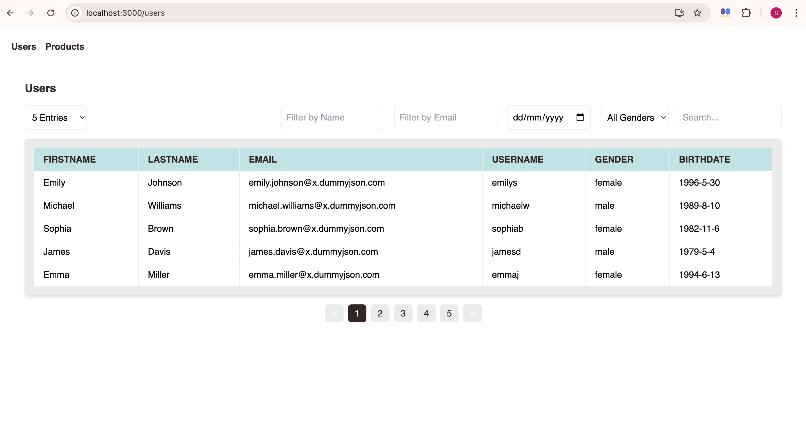
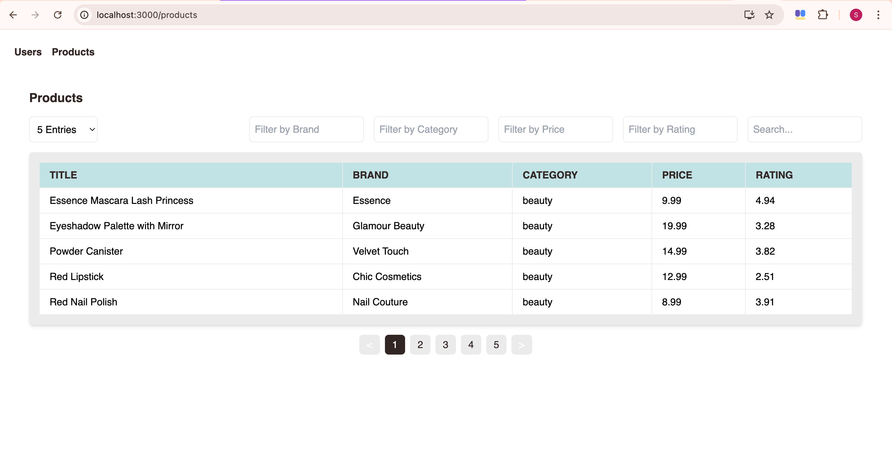
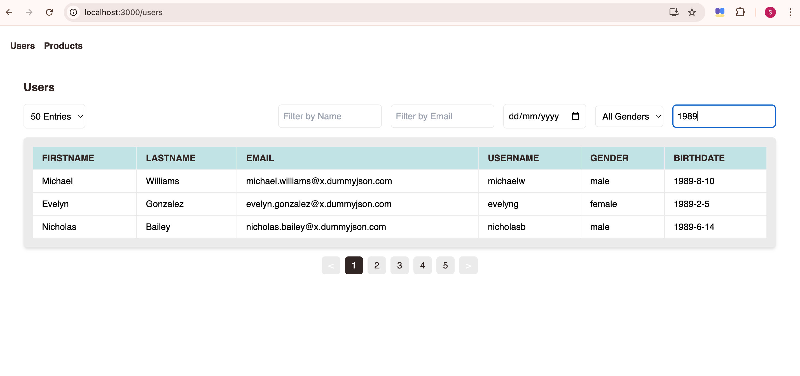

# Users and Products Dashboard

This project is a simple dashboard application built with React and TypeScript, showcasing data from the DummyJSON API (https://dummyjson.com/). It features two pages: /users and /products, both utilizing reusable components and demonstrating data fetching, state management, and filtering.

## Features

* **Data Fetching:** Uses the `axios` library to fetch user and product data from the DummyJSON API.
* **State Management:** Employs Redux Toolkit to manage application state, including fetched data, pagination, and filter values.
* **Filtering:**
    * **Page Size:** Allows users to select the number of items to display per page (5, 10, 20, 50).
    * **Search:** Provides a client-side search functionality to filter data based on a search query.
    * **Other Filters:** Offers various filters for users (name, email, birth date, gender) and products (title, brand, category) that interact with the API to fetch filtered data.
* **Pagination:** Implements pagination to navigate through large datasets.
* **Data Table:** Displays fetched data in a tabular format with relevant columns.
* **Styling:** Utilizes Tailwind CSS for styling with a specified color palette.
* **Font:** Uses the "Neutra Text" font family.

## Technologies Used

* React
* TypeScript
* Redux Toolkit
* Axios
* Tailwind CSS
* DummyJSON API

## Installation and Setup

1. Clone the repository: `git clone <repository-url>`
2. Install dependencies: `npm install`
3. Start the development server: `npm start`

## Screenshots

Users Page

Products Page

Users/ Filter by name

Users/ Filter by Email

Users/ Search

Products/ Filter by Category

Products/ Filter by Price

Products/ Filter by Rating
